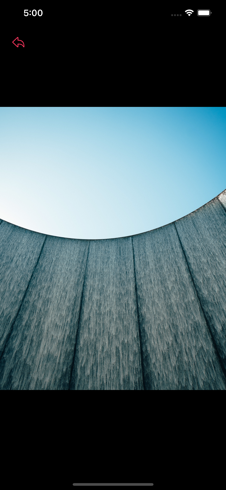

# Photos App

A simple UIKit app displays featured images using Unsplash API

  

    
## Consist Of
- Photos List Screen
- Photo Details

    
## Tech Stack
- UIKit
- Architectural pattern (MVVM)
- Combine
- Clean Architecture
- Design Patterns (Coordinator - Repository)
    

## Used Pods
- SwiftLint for code style
- SDWebImage for image caching
    

## Requirements
- iOS 13.1 or later.
- Xcode 13.0 or later.
    

## Installation
Dependencies in this project are provided via Cocoapods. Please install all dependecies with

```bash
pod install
```

if you are using Macbook M1, maybe you will face an error while executing the previous command, so you can try the following commands
```sh
sudo arch -x86_64 gem install ffi
arch -x86_64 pod install
```

    
## Authors

- [Ramy Sabry](https://www.linkedin.com/in/ramy-aiman-sabry-153770117/)

  

